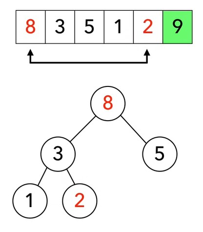

<h1>How Does Dataset Size Impact the Efficiency of Heapsort?

Author: Aariz Sattar

Reviewers: 

## Learning outcome 

9.3.3. Big-Θ notation and the analysis of the limiting behaviour of an algorith

9.3.5. Tree data structures and their 'search' and 'update' method

9.3.6. Graphs and Minimum spanning tree

 

| **Table of Contents**                                                                  | 
|-------------------------------------------------------------------------------|
| Introduction                                                              | 
| What is Heapsort?                 | 
| Code Examples and Explanation       |
| Testing Heapsort with Large and Small Data Sets  | 
| Conclusion                                                                | 
| References                                                                |

<h3>Introduction

Sorting is an important step in organizing and managing data. This essay looks at how the Heapsort algorithm works and how well it performs. It starts by explaining what sorting is, why it is important. Then, it focuses on its strengths and weaknesses.
Next, the essay compares how Heapsort performs with both large and small datasets to see how efficient it is. The goal is to understand how Heapsort works and decide when it is the best choice. This will help me learn how sorting algorithms can make my project easier to use and more efficient.

<h3>What is Heapsort? 

Heapsort is a sorting algorithm that uses a binary heap to organize and sort data efficiently with **O(n log n)** time complexity. It first creates a max-heap, where the largest number is at the top, and then repeatedly swaps the largest number with the last number in the array. The process continues until the whole array is sorted. (Suchenek, 2015) studied Heapsort’s worst-case performance and showed exactly how many steps it takes. The results were tested and confirmed with experiments, showing that Heapsort works reliably even in the hardest cases.

|    | 
|--------------------------------------------------|

We start with the array: **2, 8, 5, 3, 9, 1**.
The numbers in the array are first shown as a binary tree. This means:

•	The first number, **2**, is at the top as the root (parent).

•	The next two numbers, **8** and **5**, are the left and right children of **2**.

•	The rest of the numbers, **3**, **9**, and **1**, fill the next rows of the tree.

|     | 
|---------------------------------------------------------|

Now, heapsort works by converting this tree into a **max-heap**. A max-heap is a tree where:

•	Every parent node is greater than or equal to its child nodes.

•	The largest value is always at the top (root) of the tree.

To create a max-heap, the algorithm uses a process called **heapify**. It starts fixing the tree from the bottom (the last parent) and moves up to the root. After applying heapify, the array is rearranged so the largest number is at the top. The new array looks like this: **9, 8, 5, 3, 2, 1**.

|   | 
|-----------------------------------------------------|

At this stage, the array is now a max-heap. The next step is to sort it by removing the largest number (the root) one by one and placing it at the end of the array. This process repeats until all the numbers are sorted. Here's how it works step by step:

1.	Swap the root **(9)** with the last element **(1)** in the heap. The array now becomes: **1, 8, 5, 3, 2, 9**. The number **9** is now "sorted" and removed from the heap.

|  |  |
|---------------------------------------------------------|---------------------------------------------------------|

2.	The heap now has 5 elements, with **1** as the new root. This breaks the max-heap rule because 1 is not the largest. To fix this, we apply **heapify** to fix the heap. 

3.	During heapify, **1** is swapped with the largest child (in this case, **8**) to restore the max-heap property. The tree is adjusted, and the array becomes: **8, 3, 5, 1, 2, 9**.

|   | 
|----------------------------------------------------------|

This process repeats:

•	The largest element **(8)** is swapped with the second-to-last element **(2)** and moved to its correct position. Then heapify is called again to restore the max-heap.

|  |  |  |
|---------------------------------------------------------|---------------------------------------------------------|---------------------------------------------------------|

•	The next largest element **(5)** is swapped with the third-to-last element **(1)**, and so on.

|  |  |  |
|---------------------------------------------------------|---------------------------------------------------------|---------------------------------------------------------|

By the end, the array is fully sorted in ascending order: **1, 2, 3, 5, 8, 9**.

<h3>Code Examples and Explanation

Heapsort sorts numbers by using a special structure called a binary heap. It's fast and reliable, always finishing in O(n log n) time. Let's go through how it works step by step, with simple code examples and explanations.

The first step in heapsort is to turn the array of numbers into a max-heap. A max-heap is a binary tree where the largest number is always at the top, called the root. We create this max-heap by rearranging the numbers using a process called heapify.

In the code, this is how we build the max-heap:

|     | 
|---------------------------------------------------------|

We start from the middle of the array, which is the last parent node in the binary tree, and move upwards to the root. At each step, the heapify function checks if the parent is larger than its two children. If not, it swaps values to fix the heap. This process continues until the entire array is rearranged into a max-heap, where the largest number is at the root.

Building the max-heap is very efficient and takes O(n) time. Researchers like (Sedgewick and Wayne, 2011) found that this step is fast, even for large datasets. This is because fewer comparisons are required at higher levels of the tree, where there are fewer nodes. As a result, the process becomes quicker as it moves toward the root.

Once the max-heap is built, the sorting process begins. The largest number, which is at the root of the heap, is swapped with the last number in the array. Then, the heap size is reduced by one, and the heapify function is called again to restore the max-heap property. This process repeats until all numbers are sorted.

Here’s the sorting part of the code:

|     | 
|---------------------------------------------------------|

Each time we swap the root with the last number, the heap shrinks, and the next largest number moves to the root. By the end of this process, the array is completely sorted.

This step is very efficient, taking O(n log n) time. It’s consistent, even if the numbers are in a bad order to start with.

The heapify function is essential for keeping the max-heap structure intact. It ensures that every parent node is larger than or equal to its children. If a parent is smaller than one of its children, heapify swaps the parent with the larger child and continues down the tree until the max-heap rules are restored.

Here’s the code for the heapify function:

|     | 
|---------------------------------------------------------|

This function keeps the heap in order by comparing the parent with its children. If one of the children is larger, it swaps them and continues checking until the heap is fixed. The process is fast because it only goes down one side of the tree, taking O(log n) time.

In conclusion, Heapsort is a reliable and efficient sorting method. It works by first creating a max-heap and then sorting the numbers step by step by removing the largest number and fixing the heap. This makes it a great option for sorting both small and large datasets.
Unlike quicksort, which can slow down to O(n^2) in the worst case, Heapsort always works in O(n log n) time, no matter how the numbers are arranged (Warse.org, 2021). Studies (Suchenek, 2015) show that Heapsort performs well even with difficult inputs. It is also better than merge sort when memory is limited because Heapsort only uses the input array to do the sorting, while merge sort needs extra memory for temporary arrays.
Overall, Heapsort is a strong and consistent algorithm. It is fast, uses less memory, and works well in any situation, making it a great choice for sorting.

<h3>Testing Heapsort with Large and Small Data Sets

Heapsort is a reliable sorting algorithm that works well in many situations. It is known for its consistent speed about O(n log n) time. But is heapsort better for small amounts of data or for large datasets? Let’s explore this question using research and examples.

Heapsort is not the best choice for small datasets. This is because it takes extra steps to build a max-heap before it can start sorting. For small arrays, these extra steps take more time than simpler algorithms like insertion sort. Insertion sort is simple and works by directly comparing and swapping numbers, making it more suitable for datasets with fewer than 20 elements (Cormen et al., 2009).

Another algorithm, quicksort, also outperforms heapsort for small datasets. Many quicksort implementations switch to insertion sort for smaller datasets because it is faster in these cases (Sedgewick & Wayne, 2011). The process of building the max-heap in heapsort adds extra steps that aren’t needed for small datasets. This makes it less efficient compared to simpler algorithms like insertion sort or quicksort, especially when quicksort is optimized to handle small arrays more effectively. These alternatives are better suited for sorting smaller datasets. 

For large datasets, heapsort is much more efficient. Unlike quicksort, which can slow down to O(n^2) time in the worst case, heapsort always takes O(n log n), no matter how the data is arranged. This makes it more reliable for big datasets. Another reason heapsort is good for large data is its low memory usage. Heapsort sorts numbers in-place, meaning it doesn’t need extra space to store temporary data. Other algorithms like merge sort need extra memory, which can be a problem when working with very large datasets (Knuth, 1997). 

Research also shows that heapsort works well with millions of elements. For example, (Suchenek, 2015) compared heapsort and quicksort and found that heapsort performed more consistently for large arrays, especially when memory was limited. Heapsort is fast, reliable, and doesn’t need extra memory. This makes it perfect for sorting large datasets, especially when the data is stored in an array and memory is tight.

In short Heapsort is a good algorithm, but its efficiency depends on the size of the data. For small datasets, it’s better to use simpler methods like insertion sort or quicksort. For large datasets, heapsort shines because it is fast, consistent, and doesn’t use extra memory. Research shows that heapsort is especially helpful in situations where predictability and memory efficiency are important.

<h3> Conclusion

In conclusion heapsort is a reliable and efficient sorting method, but whether it’s the best choice depends on the size of the dataset. For small datasets, heapsort is not ideal because building the max-heap takes extra time. Simpler algorithms like insertion sort or quicksort are faster for small amounts of data. For large datasets, heapsort is a great choice. It has consistent O(n log n) speed and uses very little memory. Unlike quicksort, which can slow down with bad input, heapsort works reliably no matter how the data is arranged. This makes it especially useful for big datasets or when memory is limited.

<h3>References</h3>

1.	AlgoDaily. (z.d.). AlgoDaily - Daily coding interview questions. Full programming interview prep course and software career coaching. Retrieved on December 8, 2024, from https://algodaily.com/lessons/merge-sort-vs-quick-sort-heap-sort
2.	A Suchenek, M. (2015). A Complete Worst-Case Analysis of Heapsort with Experimental Verification of Its Results: A manuscript (MS) intended for future journal publication. In California State University Dominguez Hills, Department Of Computer Science (1504.01459v1). Retrieved on December 7, 2024, from https://arxiv.org/pdf/1504.01459
3.	GeeksforGeeks. (2024, 28 september). Heap Sort Data Structures and Algorithms Tutorials. GeeksforGeeks. Retrieved on December 8, 2024, from https://www.geeksforgeeks.org/heap-sort/
4.	Introduction To Algorithms Third Edition (2009). By Thomas H Cormen (Author), Charles E Leiserson (Author), Ronald L Rivest (Author), Clifford Stein (Author): Free Download, Borrow, and Streaming: Internet Archive. (2024, 11 januari). Internet Archive. Retrieved on December 7, 2024, from https://ia801206.us.archive.org/11/items/introduction-to-algorithms-third-edition-2009/Introduction_to_Algorithms_Third_Edition_(2009).pdf
5.	Performance Analysis of Heap Sort and Insertion Sort Algorithm. (z.d.). In International Journal Of Emerging Trends in Engineering Research. Retrieved on December 7, 2024, from https://www.warse.org/IJETER/static/pdf/file/ijeter08952021.pdf
6.	Team, T. A. (2022, 22 maart). Retrieved on December 8, 2024, from, van Big O notation: What is it? Towards AI. https://towardsai.net/p/programming/big-o-notation-what-is-it
7.	THE ART OF COMPUTER PROGRAMMING: SECOND EDITION. (z.d.). Stanford University. Retrieved on December 7, 2024, from https://vivekupadhyay125.wordpress.com/wp-content/uploads/2013/08/donald-e-knuth-the-art-of-computer-programming-vol-3.pdf
8.	Wayne, R. S. A. K. (z.d.). Quicksort. Retrieved on December 7, 2024, from https://algs4.cs.princeton.edu/23quicksort/

